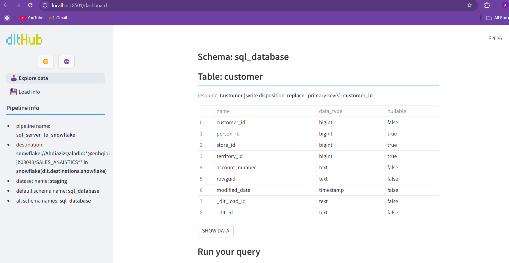

# Data Engineering Project: Sales Performance & Customer Insights

## Project Overview

This Data Engineering project focuses on building a comprehensive **Sales Analytics Pipeline** that extracts, transforms, and loads (ETL) data from SQL Server into Snowflake, then applies transformations using **DBT** to create insights into **Sales Performance** and **Customer Purchase Patterns**.

The goal of this pipeline is to understand customer behavior, sales performance, and product demand trends. By analyzing key metrics, businesses can make more informed decisions about marketing, sales strategies, inventory planning, and customer retention.

### Key Business Questions Addressed by the Project
- **Customer Insights**: Who are the top customers by revenue? What regions/states have the most customers?
- **Sales Performance**: What products generate the most sales? What is the revenue trend over time?
- **Product Demand**: Which products have the highest return rates? How do discounts impact sales?

## Project Architecture

### 1. Data Ingestion
The project uses **DLT (Data Load Tool)** to move raw sales data from **SQL Server** to **Snowflake** (staging schema). This step ensures that the data is clean, resilient, and ready for transformation.

### 2. Data Transformation
Once the data is in Snowflake, **DBT (Data Build Tool)** is used to transform it into analytical tables that support various business use cases. The data is structured into two main schemas:
- **Staging Schema**: Contains raw, untransformed data (e.g., customer details, sales transactions).
- **Analytics Schema**: Contains business-ready data that is aggregated and transformed for analysis (e.g., sales performance, customer insights).

### 3. Data Orchestration
**Kestra** is used to automate and schedule the workflows, ensuring that the ETL pipeline runs at regular intervals (e.g., daily or weekly).

### 4. Data Visualization
The project integrates with **Power BI** (or any other BI tool like Tableau) to create dashboards that visualize key metrics and trends for business stakeholders.

---

## Data Model

### Staging Models (Raw Data Cleaned & Standardized)

The staging models clean and standardize the raw tables, preparing them for further analysis:
- **stg_customers**: Cleans customer data.
- **stg_sales_orders**: Cleans sales order headers.
- **stg_sales_order_details**: Cleans sales order line items.
- **stg_products**: Cleans product data, including categories and subcategories.
  
These tables allow for efficient querying and aggregations in the downstream analytics models.

### Analytics Models (Business-Ready Data for Reporting)

The analytics models are designed to calculate key metrics and generate insights:
- **sales_performance**: Calculates total revenue, number of orders, and top-selling products.
- **customer_analysis**: Analyzes top customers, customer lifetime value, and purchase behavior.
- **product_demand**: Identifies the most returned items and top-selling categories.
- **discount_impact**: Analyzes how discounts and promotions affect sales.

### Fact Table: **fact_sales**

The **fact_sales** table aggregates transactional data and includes key metrics such as:
- **Total Quantity Sold**: Total quantity of each product sold.
- **Total Sales Amount**: Total revenue generated for each product.
- **Subtotal, Tax, Freight, Total Due**: Financial metrics associated with individual orders.

This table serves as the foundation for understanding the sales performance and customer purchase patterns.

---

## Key Business Impact: Analyzing Customer Purchase Patterns

Analyzing **Customer Purchase Patterns** provides critical insights into customer behavior, which helps businesses optimize their strategies for marketing, sales, inventory management, and customer retention. Here's how:

### 1. **Personalized Marketing & Recommendations**
   - Identify frequent buyers and their preferences.
   - Suggest relevant products or promotions based on past purchases.
   - Boost sales through personalized marketing strategies.

### 2. **Optimizing Pricing & Special Offers**
   - Analyze how discounts and special offers impact customer spending.
   - Adjust promotions to maximize revenue and profitability by targeting specific customer segments.

### 3. **Customer Segmentation & Retention**
   - Segment customers based on buying behavior (e.g., high-value vs. occasional buyers).
   - Implement targeted retention strategies, such as loyalty programs or exclusive deals, to increase customer loyalty and lifetime value.

### 4. **Sales Forecasting & Inventory Planning**
   - Predict future demand based on purchase trends and historical data.
   - Optimize inventory levels to reduce overstock and minimize stockouts, ensuring a smooth supply chain.

### 5. **Customer Lifetime Value (CLV) Analysis**
   - Identify high-value customers who contribute the most to long-term revenue.
   - Focus marketing efforts on retaining profitable customers and nurturing their loyalty.

---

## Project Setup

### 1. **Clone the Repository**

Start by cloning the repository:

```bash
git clone https://github.com/Qaladid/sales-analytics-pipeline.git
cd sales-analytics-pipeline
```

## 1. **Download the Project Data from Microsoft (AdventureWorks2019)**

Before starting with Power BI, ensure you have the required data in your **SQL Server** database. For this project, we will use **AdventureWorks2019** as the dataset.

### Step 1: Download AdventureWorks2019
- Go to the [Microsoft AdventureWorks Database Page](https://github.com/Microsoft/sql-server-samples/releases/tag/adventureworks).
- Download the **AdventureWorks2019.bak** file, which is the backup of the AdventureWorks database.

### Step 2: Restore AdventureWorks2019 in SQL Server
Once you have the `.bak` file, you need to restore it in your **SQL Server**:

1. Open **SQL Server Management Studio (SSMS)**.
2. Connect to your **SQL Server** instance.
3. Right-click on **Databases** and select **Restore Database**.
4. Choose **Device** and select the `.bak` file you downloaded.
5. Follow the prompts to restore the database, and the **AdventureWorks2019** database will be available in your SQL Server.

---

## 2. **Ingest Data to Snowflake Using DLT (Data Load Tool)**

Now that the data is restored in SQL Server, the next step is to move it to **Snowflake**. This step is crucial for transforming and structuring the data to support analytical queries.

## 3. **Data Orchestration Using DLT**

In this step, we use **DLT (Data Load Tool)** to automate and schedule the workflows, ensuring that the ETL pipeline runs regularly. This tool helps manage and monitor the ETL process from **SQL Server** to **Snowflake**.

### Step 1: Show DLT Pipeline

To view and monitor the status of your DLT pipeline, use the following command:

```bash
dlt pipeline sql_database_pipeline show
```
 


### Step 1: Set Up Snowflake
1. Log in to your **Snowflake** account.
2. Create a **database** and **schema** where you will store the ingested data.
3. Ensure you have the necessary **roles and permissions** to load data into the Snowflake database.

### Step 2: Use DLT to Ingest Data to Snowflake
We will use **DLT (Data Load Tool)** to automate the data ingestion process from SQL Server to Snowflake.

1. **Install DLT**:
   - DLT is a tool used to ingest and move data from one system (like SQL Server) to another (like Snowflake). Ensure that you have set up DLT for your project.
   
   - **To Install**: Follow the [DLT documentation](https://docs.dlt.io/) to get started with DLT for Snowflake.

2. **Configure DLT**:
   - Once DLT is set up, configure it to pull the **AdventureWorks2019** data from **SQL Server** and push it to **Snowflake**.
   - Set up a **connection** between your Snowflake account and SQL Server.
   
3. **Run DLT to Ingest Data**:
   - Run the DLT script to move the data from **SQL Server** to **Snowflake**.
   - Ensure the data is loaded into the appropriate Snowflake schema for downstream transformations and analysis.

---

## 3. **Transform Data with DBT**

Once the raw data is ingested into Snowflake, we will use **DBT (Data Build Tool)** for transforming the data into analytical tables.

1. **Set Up DBT**:
   - Follow the [DBT setup documentation](https://docs.getdbt.com/docs/introduction) to install and configure DBT for your project.
   
2. **Define DBT Models**:
   - Define **staging models** for cleaning and standardizing raw data.
   - Define **analytics models** that aggregate and transform the data for analysis (e.g., sales performance, customer analysis, etc.).

3. **Run DBT Models**:
   - Execute the DBT commands to run the models and transform the raw data into business-ready datasets.
   
4. **Load Transformed Data into Snowflake**:
   - Once the transformations are complete, the data will be available in the Snowflake database, ready for reporting and analysis.

---

# Power BI Integration and Data Visualization: Step-by-Step Guide

After setting up your data pipeline and transforming the data in **Snowflake**, the next step is to use **Power BI** for data visualization. Below is a step-by-step guide to integrating Power BI with the project and navigating the data from **SQL Server** to **Snowflake**, and ultimately to Power BI for reporting and dashboards.

---

## 4. **Power BI Integration**

Now that your data is in **Snowflake**, the next step is to integrate Power BI to visualize the data.

### Step 1: Connect Power BI to Snowflake
1. Open **Power BI Desktop**.
2. Click on **Get Data** in the ribbon and select **Snowflake** from the available data sources.
3. Enter the **Snowflake account details** (URL, warehouse, database, schema) to establish the connection.
4. Choose the **tables** or **views** you want to load into Power BI.

### Step 2: Load Data into Power BI
1. Once the connection is established, select the relevant tables or views from Snowflake.
2. Click **Load** to import the data into Power BI.
   
   - Power BI will now bring in the tables and columns that you will use for visualization.

### Step 3: Create Visualizations
1. **Create Reports**:
   - In Power BI, start creating reports by dragging and dropping fields into the report canvas.
   - For example:
     - **Sales Performance**: Drag `Product_ID` and `Total_Sales_Amount` to visualize the sales by product.
     - **Customer Insights**: Use `Customer_ID` and `Total_Sales_Amount` to see the top customers.
     - **Time Trends**: Use `Order_Date` to visualize sales trends over time.
   
2. **Add Filters**:
   - Add slicers or filters based on key fields (e.g., `Customer_ID`, `Product_ID`, `Order_Date`) to allow users to drill down and analyze specific data.

3. **Customize Reports**:
   - Add custom charts like bar graphs, line charts, and pie charts to represent your data visually.
   - Use conditional formatting and KPI indicators to highlight key metrics like top-performing products or customers.

### Step 4: Publish and Share Dashboards
1. After creating the necessary visuals, you can publish your report to the **Power BI service** for sharing with other stakeholders.
2. Set up scheduled refreshes to ensure the report is updated with the latest data from Snowflake.

---

## 5. **Next Steps for Advanced Visualization**
- **Explore More Power BI Features**:
   - Use advanced features like **What-If Analysis**, **DAX Calculations**, and **Power BI Service Dashboards** to enhance your reporting.
   
- **Create Dashboards for Business Insights**:
   - Create dashboards to analyze:
     - **Top Products** by total sales
     - **Top Customers** by total revenue
     - **Sales Trends** over specific time periods (e.g., monthly, quarterly)
     - **Sales by Region/Territory**
     - **Customer Segmentation** based on spending behavior

---

## Conclusion

By following the above steps, you will have successfully set up a data pipeline from **SQL Server** to **Snowflake**, transformed the data with **DBT**, and created insightful **Power BI reports and dashboards**. This workflow empowers your team to make data-driven decisions based on sales performance, customer insights, and product demand trends.

